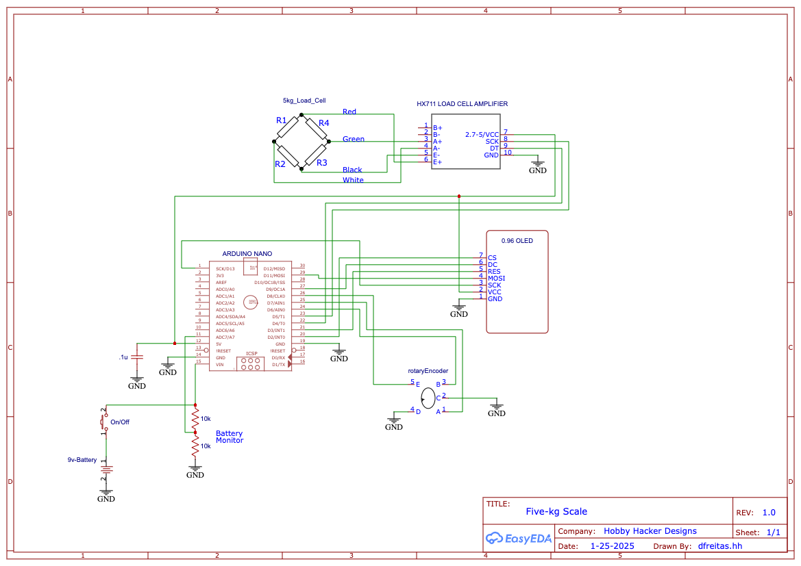
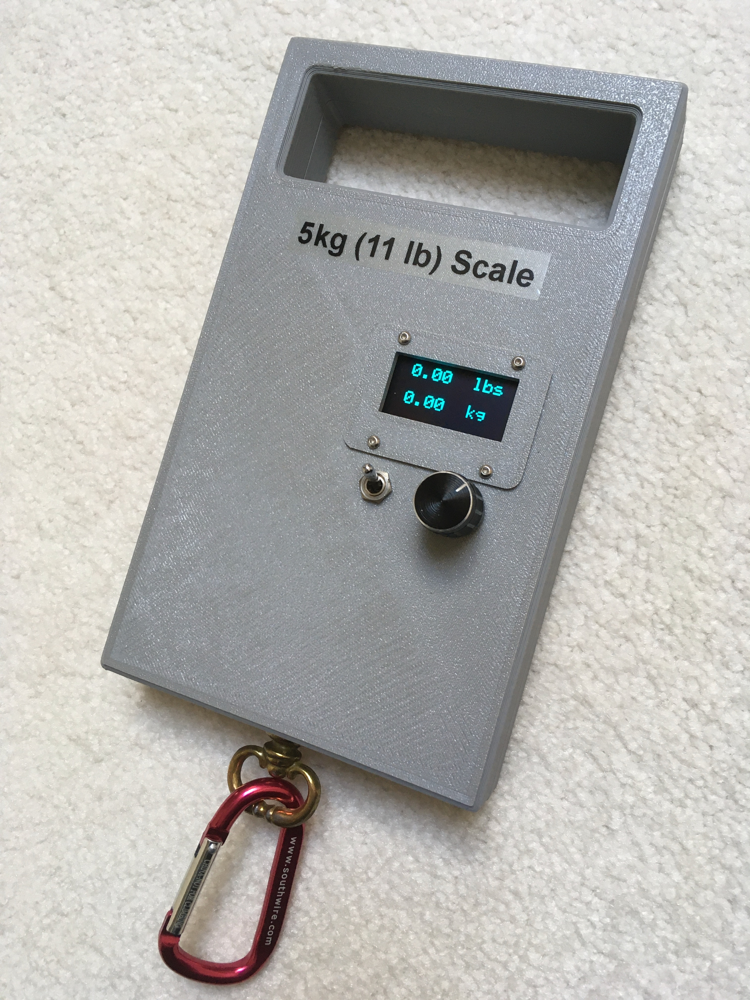
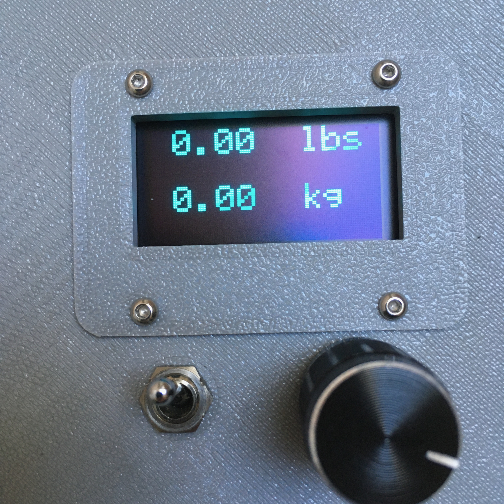
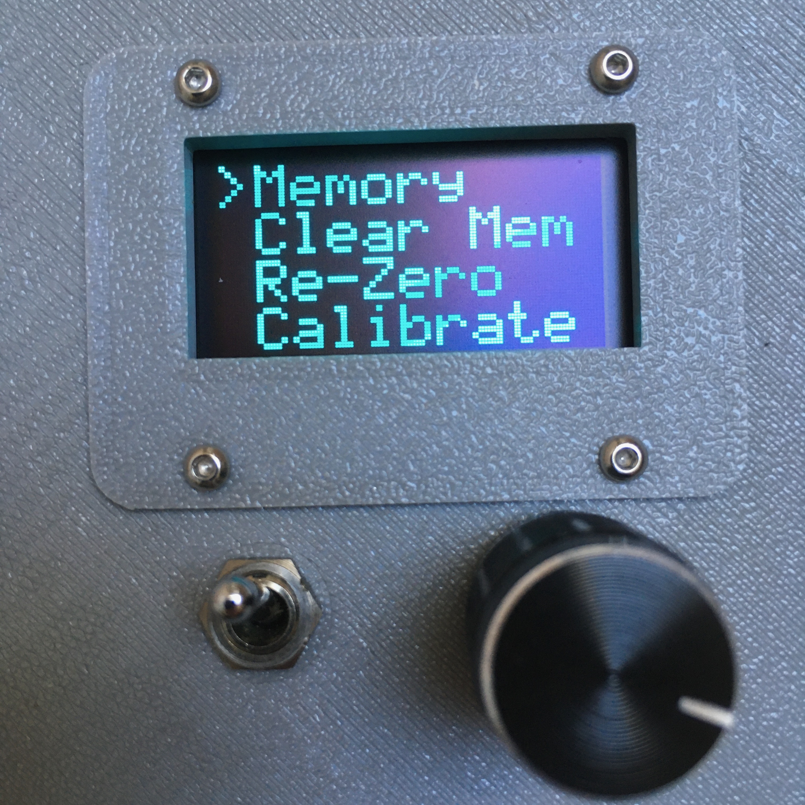

# 5kg Scale
* Menu  control box for driving up to four servos.   

/*******************************************************************************************************
This is the code to implement Jeff's 20Kg load-cell based scale.  Conditionally, we also use the
code to buile the KITTY_SCALE and the FIVE_KG_SCALE.

Uses an HX711 to interface to a full Whetstone Bridge load-cell.  Weight
displayed on a 128x64 SH1106 OLED display.

Scale will auto zero upon power up. Can be re-zeroed using the menu command "ReZero".
Weight will be displayed in lbs and Kg on the OLED.

The 9v battery is monitored via a resistor divider and analoginput.  If it drops too low,
a low-battery warning is flashed in the display.

The scale's calibration constant is stored in EEPROM and can be reset using the "Calibrate" command.
To calibrate:
   1) Get a known reference object (around a pound in weight).
   2) Go to the calibrate menu and click on "Enter Ref"  and dial in the reference weight in x.yy pounds.
   3) Click on the "Run Cal" command.
   4) A new cal value will be calculated.  Click on "Save Cal" to store the value in EEPROM.

You can also manually adjust the calVal by clicking on "Edit Cal".  Dial in the number you want then
click on "Save Cal" to store it in EEPROM.

Scale readings can be stored in eight memory locations (M0-M7).
- To store a value, go to the Memory menu,
  move the cursor to the location you want to store at then click the rotary switch.  Confirm you want to
  store by double-clicking.  If you single-click you will abort the store.
- To clear an individual memory location, long-press the switch.
- To clear all the memory locations at once, click on "Clear Mem".

We are using the SSD1306Ascii library as it's a lighter weight driver for the OLED.  The full frame-buffer
version of the library uses up too much memory in the Nano, not leaving any for additional variables...

Jeff's and the KITTY_SCALE use the wire library to implement I2C interface.  The FIVE_KG_SCALE uses an SPI display.

Using a rotary encoder with click-switch to implement a simple menu system to allow
things like storing/recalling measurments, re-zeroing the scale, re-calibrating, etc.
Currently a max of 8 rows per menu is allowed.  Clicking pushes into a menu/item.
Double-clicking returns to the parent menu.  Rotating the knob scrolls through the
menu items.  Library at: https://github.com/0xPIT/encoder

Uses HX711 ADC library to drive the load-cell ADC/amplifier
https://github.com/olkal/HX711_ADC

dlf  1/26/2025

### Schematics

### Build Pictures

